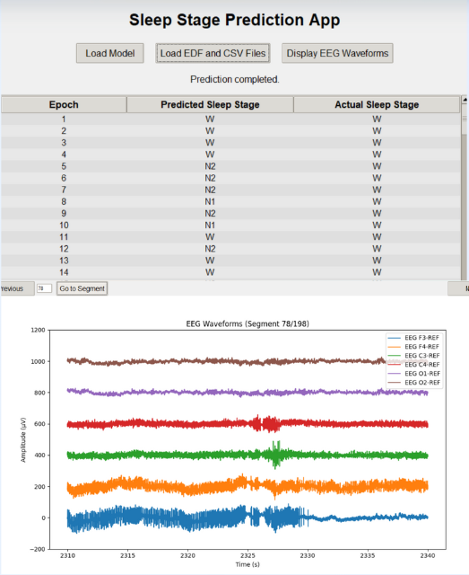

# Sleep Apnea Detection & Sleep Stages Classification

**Fall 2024**  
*EECE 490 - Introduction to Machine Learning*  
Instructor: Dr. Joseph Bakarji  

---

### Team Members:
- **Karim Nasreddine**
- **George Habib**
- **Kareem Hassani**
- **Roni Bou Saab**

---

This repository contains machine learning and deep learning models developed for **Sleep Apnea Detection** and **Sleep Stages Classification**. The models implement a range of algorithms, from traditional machine learning techniques like **Logistic Regression**, **SVM**, and **GMM** to advanced deep learning models such as **Autoencoders**, **CNN**, **RNN**, and two **Deep Neural Networks**.

Please note that the data used for training and testing these models is **not provided** and is **not open source**. Users are expected to supply their own data that fits the model requirements.

## Project Structure

```
Sleep Apnea Detection
|-- GMM
|   |-- ClusteringGMM.py
|-- Logistic Regression
|   |-- logistic_regression.py
|-- SVM
|   |-- Sleep_Apnea_Detection_Using_SVM.ipynb
|-- rf_xgb_gbr_mlp_health_regression
|   |-- stacked_ensemble_rf_xgb_gbr_mlp_AHI_data_regression.py

Sleep Stages Classification
|-- Autoencoder
|   |-- AE.py
|-- Basic_CNN
|   |-- cnn.ipynb
|-- CNN: Input as Image of Spectrogram
|   |-- CNN_image.py
|-- Deep Neural Network Model 1
|   |-- Deep_Model_1_lstm_cnn.py
|-- Deep Neural Network Model 2
|   |-- Deep_Model_2.py
|-- RNN
|   |-- rnn.ipynb

Additional Files
|-- MNEBest_Extraction.py
|-- UI.py
|-- README.md
```

## File Descriptions

### Sleep Apnea Detection

- **GMM (Gaussian Mixture Model)**:
  - `ClusteringGMM.py`: Implements a **Gaussian Mixture Model** for clustering and detecting sleep apnea in health data. PCA was used for dimensionality reduction before running GMM.

- **Logistic Regression**:
  - `logistic_regression.py`: A **Logistic Regression** model to classify sleep apnea based on input features.

- **SVM (Support Vector Machine)**:
  - `Sleep_Apnea_Detection_Using_SVM.ipynb`: Jupyter notebook that applies **SVM** for detecting sleep apnea.

- **Stacked Ensemble Model**:
  - `stacked_ensemble_rf_xgb_gbr_mlp_AHI_data_regression.py`: This script implements a **stacked ensemble** approach using **Random Forest**, **XGBoost**, **Gradient Boosting**, and **MLP** models to predict the **AHI (Apnea-Hypopnea Index)**. This script provides a visual representation of the imporatance of the features used.

### Sleep Stages Classification

- **Autoencoder**:
  - `AE.py`: An **Autoencoder** model for **unsupervised feature extraction** and classification of sleep stages.

- **Basic CNN**:
  - `cnn.ipynb`: A **Convolutional Neural Network (CNN)** implemented in a Jupyter notebook for classifying sleep stages from raw data.

- **CNN with Spectrogram Input**:
  - `CNN_image.py`: Implements a **CNN** that uses **spectrogram images** as input to classify sleep stages.

- **Deep Neural Networks 1**: 
  - `Deep_Model_1_lstm_cnn.py`: A Deep Neural Network (DNN) using LSTM and CNN layers to classify sleep stages from raw waveform data.

- **Deep Neural Networks 2**: 
  - `Deep_Model_2.py`: An alternative **Deep Neural Network (DNN)** built primarily with a **CNN** architecture for sleep stages classification. The input consist of the **spectrogram** of the EEG file provided.

- **RNN (Recurrent Neural Network)**:
  - `rnn.ipynb`: A **Recurrent Neural Network (RNN)** model for time-series data classification of sleep stages.

### Additional Files

- **MNEBest_Extraction.py**: Create an image dataset from the EDF files: classifying the into training, testing and validation. Also, it includes data augmentation methods.
  
- **UI.py**: A **User Interface (UI)** script that allows interaction with the sleep apnea and sleep stages models.

## Data

The **data** used for training and evaluating these models is **not provided** in this repository, and the data is not open source. You will need to obtain a suitable dataset for sleep apnea detection or sleep stages classification in order to use the models effectively. Please ensure that your dataset is preprocessed and structured according to the requirements of the respective models.


### Running the Scripts

1. **For Sleep Apnea Detection**:
   - Choose one of the detection models such as **Logistic Regression**, **SVM**, or the **Stacked Ensemble Model** and provide your own dataset.
   
2. **For Sleep Stages Classification**:
   - Choose a classification model such as **CNN**, **RNN**, **Autoencoder** or one of the *Deep Neural Networds* and supply a dataset suitable for sleep stages classification.

3. **User Interface**:
   - If you'd like to interact with the models via a graphical interface, run `UI.py` to launch the user interface.

## Contributing

Feel free to fork this repository and contribute by creating pull requests. If you encounter any issues or have suggestions, please open an issue.

---